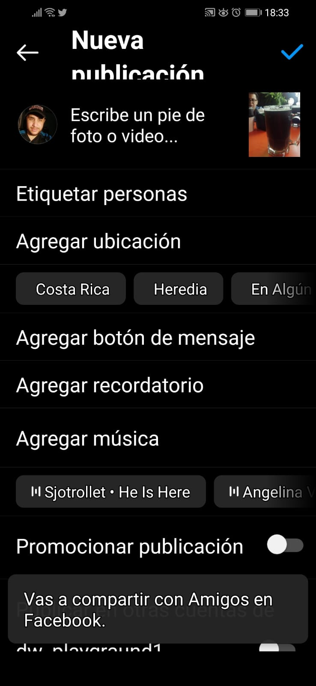
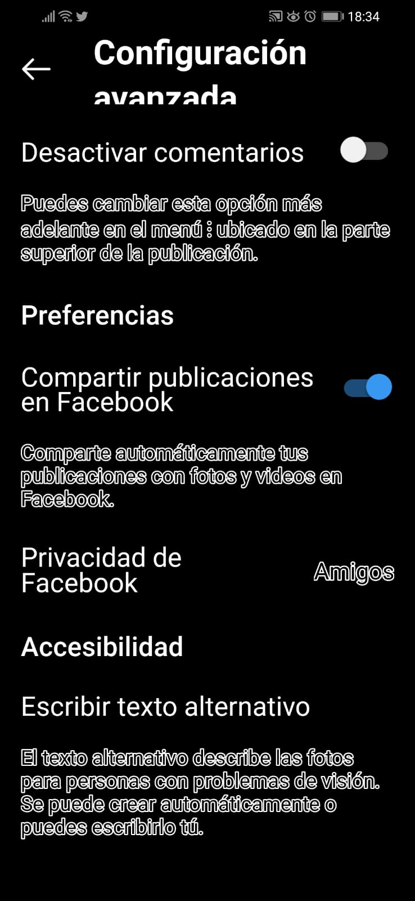
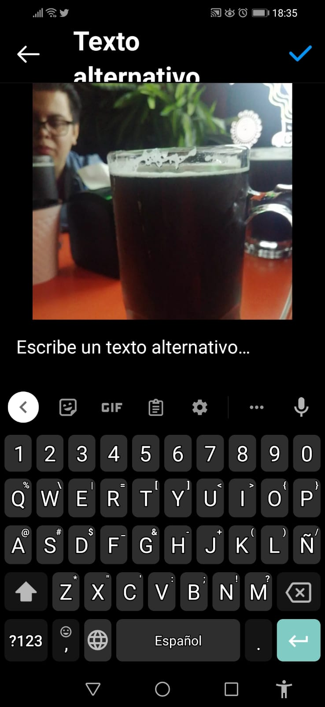

# __Redes Sociales accesibles:__

## Introducción: 

Hoy en día, la gran mayoría de personas usan *redes sociales* y entre ellas hay personas con discapacidad, en este documento, hay consejos para que tus publicaciones sean lo más accesibles posible para una __persona con discapacidad visual__. 

Una definición de ~~Red Social~~ es: 

> "Las redes sociales son estructuras formadas en Internet por personas u organizaciones que se conectan a partir de intereses o valores comunes. A través de ellas, se crean relaciones entre individuos o empresas de forma rápida, sin jerarquía o límites físicos."

### Redes sociales más usadas: 

Esta lista de redes sociales esta creada por *la cantidad de usuarios al mes*: 

1. Facebook: 2700 millones 
2. YouTube: 2200 millones 
3. WhatsApp: 2000 millones 
4. Messenger: 1300 millones 
5. Instagram: 1280 millones 
6. WeChat: 1220 millones 
7. TikTok: 732 millones 

## ¿Cómo volver accesible una publicación en Redes sociales?

Ce nota, en la lista anterior, que la gran mayoria de las redes sociales mas de uso de __multimedia__, por lo que ser accesible. Haremos dos ejemplos de redes con multimedia. 

### Una publicacióm instagram: 

Supongamos que tenemos una publicacion en __instagram__, asi que:

- Subimos la foto a la interfaz de publicación. (imagen 1)
- en la parte de agregar datos, por ejemplo, la ubicacion geografica, un comentario y actualmente musica, se debe ir hasta **más opciones**. (imagen 2)
- En ese lugar, se va hasta abajo y en ___"Escribir texto alternativo"___. 
- Hay se escribe una *__breve descripción__*, evite ~~los simbolos y signos~~.(==imagen 3==)

Nota: Estas pequeñas instrucciones, se pueden aplicar a redes sociales similares a Instagram como VSCO, Twiter y Pinterest. 

### Publicacion de video: 

En el tema de publicar videos, **no es tanto el uso de _"descripciones alternativas"_, sino en el contenido del mismo**. Es decir, al momento de planear, grabar y postproducir un video se deben conciderar diversos puntos: 

- Voz en Off o que describa: importante ya que un video que solo tiene texto ~~no es accesible~~ a una persona ciega o de baja vision. 
- Si usa muchos recusos de imagenes, trate de que las misma sean lo mas concretas posibles y que esten relacionadas. 
- Use un buen contraste: Por ejemplo:
  - Si es texto, colores claros sobre oscuros o viseversa. (imagen 4)
  - En el audio tambien es importante, module la intensidad de la misica de fondo, la voz o el contenido audible. Es decir que ninguno __estorbe__ al otro. 
  

## Otras paginas interesantes u publicaciones de ejemplo: 

1.  [Accesibilidad Web](http://accesibilidadweb.dlsi.ua.es/?menu=deficit-visual-baja-vision) 
2.  [Ejemplo de publicación accesible en Instagram](https://www.instagram.com/p/CrHyklvutzG/?igshid=YmMyMTA2M2Y=)
3.  [Un ejemplo de descripción en Facebook, cortesía de la Municipalidad de Heredia](https://m.facebook.com/story.php?story_fbid=pfbid0JpvDF3gqcqKLSmvXrxMNpvdbkhPf9RgmkyAY9EqtRuTTaQL5Humw5fUdkVy1vGjWl&id=100064836814543&mibextid=Nif5oz)

Pagina creada por __Wagner Chacón Ulate__, para el curso *GF 0604 Procesamiento de Datos GEograficos* 